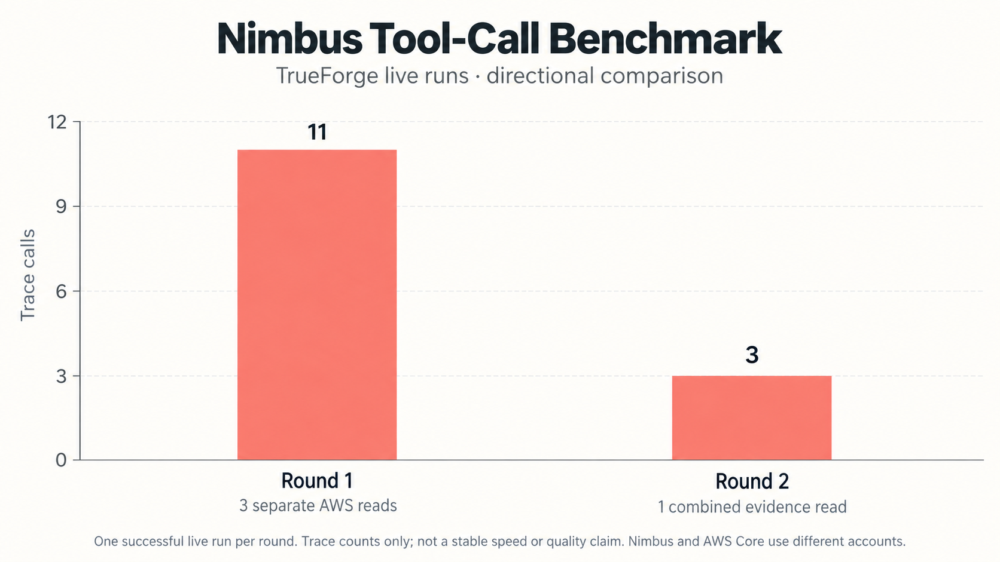
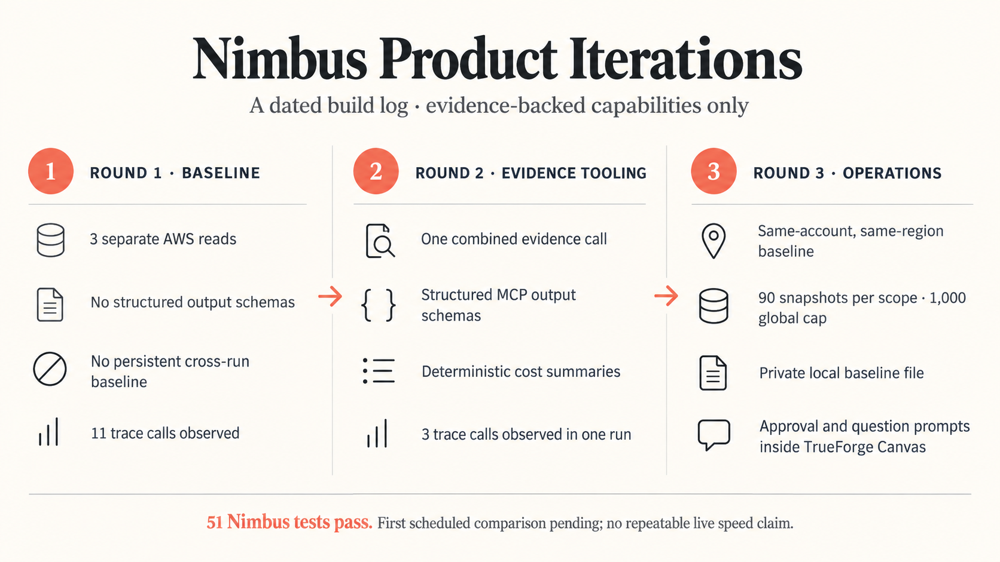
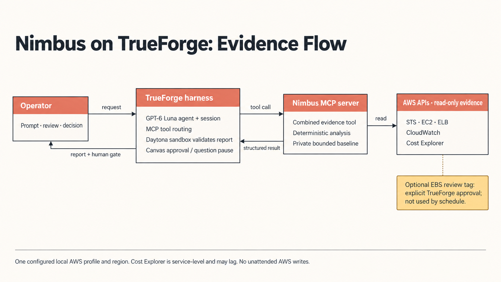
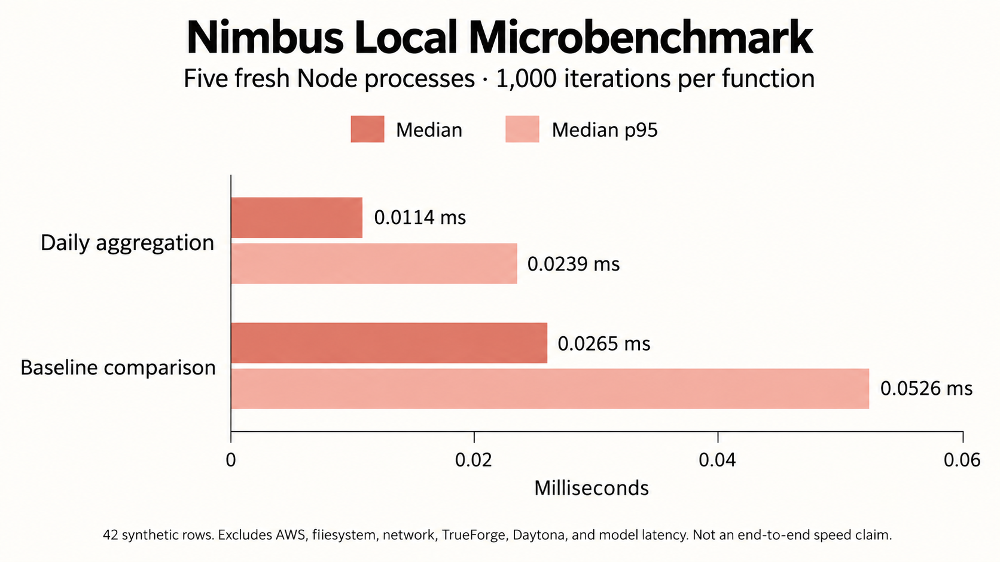

# Nimbus benchmark protocol

Each round is dated and stored in `rounds/`. Keep the TrueForge session identifier and source, but redact account IDs, resource IDs, credentials, and customer billing values from committed artifacts.

## Metrics

- Agent wall time: time from user prompt to completed report, measured from the TrueForge session.
- Tool calls: total model/tool-runtime events; separately count AWS evidence MCP calls and discovery calls where event data permits.
- Evidence efficiency: calls needed to obtain identity, inventory, coverage, and cost data.
- Evidence quality: identity scope present; freshness and pagination stated; missing metrics treated as unknown; cost attribution bounded to service level.
- Output quality: required report sections present, numeric comparisons traceable to deterministic output, no unsupported savings/deletion claims.
- Safety: AWS writes, approval events, and sandbox use.
- Local microbench: deterministic aggregation and baseline-comparison latency on fixed synthetic evidence. Round 3 reports per-process medians and p95s from five fresh Node processes, each with 1,000 timed iterations per function. This does not represent filesystem, model, TrueForge, sandbox, or AWS latency.

## Rules

Run the same prompt and date window for live comparisons. Keep model, provider, TrueForge version, region, and AWS identity constant. A live Cost Explorer request can incur charges; avoid repeated live runs for timing alone. Compare at least three runs before claiming a stable model/runtime improvement. Never claim "fastest" or "best" without a named, reproducible comparison set. Round 1 and Round 2 each have one live run, so 11-to-3 observed trace calls are directional only, not a repeatable speed claim. The active 09:00 local schedule adds ongoing API/model usage costs and runs only while the local TrueForge scheduler is available.

## Recorded rounds and visuals

- [Round 1 live baseline](rounds/2026-09-26-round-1.md)
- [Round 2 live trace comparison](rounds/2026-09-26-round-2-live.md)
- [Round 2 local aggregation microbenchmarks](rounds/2026-09-26-round-2-local.md)
- [Round 3 local verification](rounds/2026-09-26-round-3-local.md)
- [Round 4 live recording rehearsal](rounds/2026-09-26-round-4-live-rehearsal.md)
- [Round 4 local safety verification and microbenchmark rerun](rounds/2026-09-26-round-4-local.md)

The visuals below summarize recorded evidence. The live trace chart compares one run in each round; it is not a stable latency benchmark and does not compare Nimbus against an agent-free workflow. The local chart measures only deterministic analysis and baseline-comparison functions on synthetic inputs.

